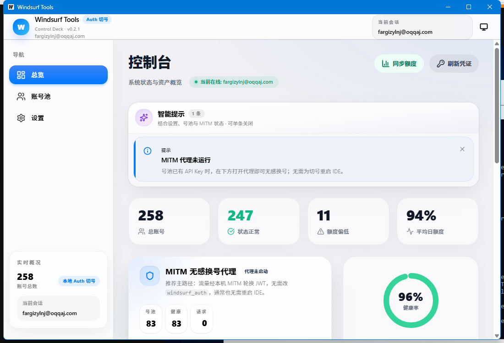

# Windsurf Tools

基于 [Wails v2](https://wails.io/)（Go + Vue 3）的 **Windsurf 账号池与无感切号** 桌面应用，用于管理多账号、同步额度与凭证、以及在本地 Windsurf 上应用无感切换相关能力。

**GitHub 仓库：** [https://github.com/shaoyu521/windsurf-Tools](https://github.com/shaoyu521/windsurf-Tools)

---

## 界面预览

| 总览 / 控制台 |
| :---: |
|  |

> 说明：上图来自本仓库 `docs/images/dashboard-preview.png`。若你更新了 UI，可自行替换该文件后提交，以便 README 与仓库展示保持一致。

---

## 主要功能

- **账号池**：支持批量导入（邮箱+密码、Refresh Token、API Key、JWT），按 Pro / Max / Teams / Trial 等计划分组展示。
- **无感切换**：检测并应用本地 Windsurf 相关补丁；「下一席位」可在 **多个计划类型中多选**（例如同时勾选 Trial + Pro），仅在所选池内轮换。
- **总览**：补丁状态、资产概览、同步额度 / 刷新凭证快捷入口。
- **设置**：代理、Windsurf 安装路径、自动刷新 Token / 额度策略等。
- **维护**：一键清理过期账号、一键删除「免费 / Basic」计划账号；**重复账号/凭证导入拦截**；大批量邮箱密码导入采用分批与轻量拉取，减轻界面卡顿。
- **数据本地化**：账号与配置保存在本机用户配置目录（见下文）。

---

## 运行环境

- **系统**：Windows 10 / 11（**amd64**）
- **运行时**：需安装 [Microsoft Edge WebView2 运行时](https://developer.microsoft.com/microsoft-edge/webview2/)（多数 Win10/11 已自带）

### 获取已构建产物

在本机执行 `wails build` 后，可执行文件位于：

```text
build/bin/windsurf-tools-wails.exe
```

也可在 GitHub **Releases** 中下载打包好的版本（若作者已上传）。

---

## 从源码构建

### 前置条件

- [Go](https://go.dev/dl/)（建议 1.21+，与 `go.mod` 一致）
- [Node.js](https://nodejs.org/)（建议 18+）
- [Wails CLI v2](https://wails.io/docs/gettingstarted/installation)

```bash
wails doctor
```

### 构建步骤

```bash
git clone https://github.com/shaoyu521/windsurf-Tools.git
cd windsurf-Tools

cd frontend
npm install
cd ..

wails build
```

成功后在 `build/bin/` 下生成 `windsurf-tools-wails.exe`。

开发调试：

```bash
wails dev
```

---

## 数据与隐私

- 默认数据目录（与代码中 `backend/store` 一致）：**用户配置目录**下的 `windsurf-tools-wails`，例如 Windows 上类似：
  - `%APPDATA%\windsurf-tools-wails\accounts.json`
  - `%APPDATA%\windsurf-tools-wails\settings.json`
- **请勿**将含有真实 Token / 密码的 `accounts.json` 提交到 Git 或公开分享。

### 勿向 GitHub 提交敏感信息

完整约定见 **[SECURITY.md](SECURITY.md)**。请尤其避免提交：

- 真实 **邮箱+密码**、**Refresh Token**、**JWT**、**个人 Windsurf API Key**（`sk-ws-...`）
- 本机 **`accounts.json` / `settings.json`**（若误放在项目根目录，已被 `.gitignore` 排除）
- `tools/` 下可能含账号信息的 **`*.txt` / `*.csv` / `*.log`**（已默认忽略）

---

## 辅助脚本（`tools/`）

仓库内 `tools/` 目录包含若干 Node / Python 辅助脚本（格式转换、批处理 JWT 等）。运行前请在本机设置环境变量 **`FIREBASE_WEB_API_KEY`**（或 `QUICK_KEY_FIREBASE_WEB_API_KEY`），值可与 `backend/services/windsurf.go` 中的 **`FirebaseAPIKey`** 一致（Firebase 网页端 Key，**不是**你的账号密码）。

根目录 **`_quick_key.py`** 需同时设置 `QUICK_KEY_EMAIL`、`QUICK_KEY_PASSWORD` 与上述 Firebase Key，**勿**把真实密码写入文件或提交到 Git。

---

## 项目结构（简要）

```text
.
├── app.go                 # Wails 绑定与业务入口
├── main.go                # 窗口与 embed 资源
├── backend/               # 模型、存储、HTTP 服务
├── frontend/              # Vue 3 + Vite + Tailwind
├── build/                 # 图标、Windows 清单等
├── docs/images/           # 文档用截图
└── wails.json
```

---

## English (short)

**Windsurf Tools** is a Windows desktop app (Wails + Vue 3) for managing multiple Windsurf accounts, refreshing quotas/tokens, and seamless account switching with configurable plan-pool filters (including **multi-select**, e.g. `trial,pro`).

- **Build**: install Go, Node, Wails CLI → `wails build` → `build/bin/windsurf-tools-wails.exe`
- **Repo**: [github.com/shaoyu521/windsurf-Tools](https://github.com/shaoyu521/windsurf-Tools)

---

## 开源许可

本项目以 [MIT License](LICENSE) 发布。

---

## 致谢

- [Wails](https://wails.io/)
- [Vue.js](https://vuejs.org/)
- [Tailwind CSS](https://tailwindcss.com/)
